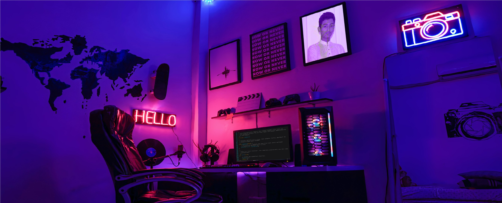

<!-- <h3 align="center">Hi , I'm Yeamin </h3> -->

  

<h2 align="center">
  
</h2>

  

<!--- portfolio launch image --->
<a href="https://mdyeamin.netlify.app/">
  
  

  
  
  

 

<!-- - 🌱 I’m currently learning **TS, react native, redux**

- 👨‍💻 All of my projects are available at [https://mdyeamin.netlify.app/](https://mdyeamin.netlify.app/)

- 📝 I regularly write articles on [https://stackoverflow.com/users/16836780/md-yeamin?tab=articles](https://stackoverflow.com/users/16836780/md-yeamin?tab=articles)

- 💬 Ask me about **react,TS,JS**

- 📄 Know about my experiences [https://drive.google.com/file/d/1VY0HU-u08JcHzFz_YsekAbUs4G3fW4Pc/view?usp=sharing](https://drive.google.com/file/d/1VY0HU-u08JcHzFz_YsekAbUs4G3fW4Pc/view?usp=sharing) -->

<h3 align="center">Connect with me:</h3>

<h3 align="center">Languages and Tools:</h3>

        

&nbsp;
<h1 align="center">
  ABOUT ME
</h1>
  

<h3>'A infinity study moment :  🎊💓'</h3>

<h5>  
I am a Frontend web Developer with the skill HTML, CSS, bootstrap, Material UI, Javascript, React.js, etc.
And I'm trying to learn backend MongoDB, express.js, node.js
I did some work in the backend,
I hope to become a full-stack developer very soon
</h5>
I'm a Frontend web developer and Fancy web designer. I started building websites in 2020. I know how to make an appealing website. Though I am a junior Developer and designer but I am very Confident about my work .
  

 <!--- Portfolio/Website --->  
  
<h1 align="center">
    Portfolio/Website
    </h2>
   
  `Personal Website` -> <a href="https://mdyeamin.netlify.app/" target="_blank">`Md Yeamin`</a>
  
  
   <!-- `Behance (Portfolio)` -> <a href="https://www.behance.net/ossamamehmood" target="_blank">`Md Yeamin`</a>
  
  `Linktree` -> <a href="https://linktr.ee/ossamamehmood" target="_blank">`Ossama Mehmood`</a> -->
  
  <!--- adding 3D earth icon to show some love for the environment 🌏 --->

  

  

  <!-- most used language  -->
 

  
  

 

 <!--  | -->

<!--- building footer with spaceship question --->

